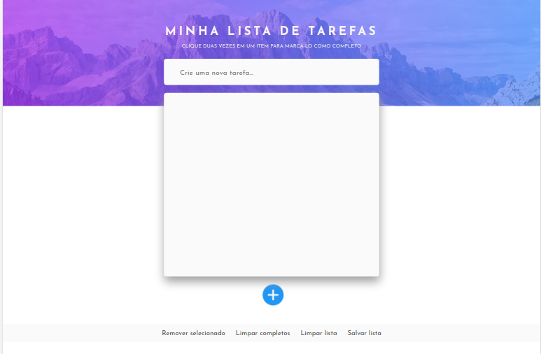

# Projeto To Do List 📝

## Sobre o projeto 📚

O projeto foi desenvolvido durante o curso na **Trybe**, com o objetivo de avaliar o nosso aprendizado.

## Tecnologias usadas ⚙

* HTML Semântico
* CSS
* JavaScript
* Web Storage

## O que eu aprendi 📖 

Durante o desenvolvimento desse projeto eu pratiquei HTML Semântico, CSS responsivo, funções, loops, arrays, objetos e local storage no JavaScript

## Quer testar o projeto ?

https://lucassilvamarts.github.io/ToDo-App/